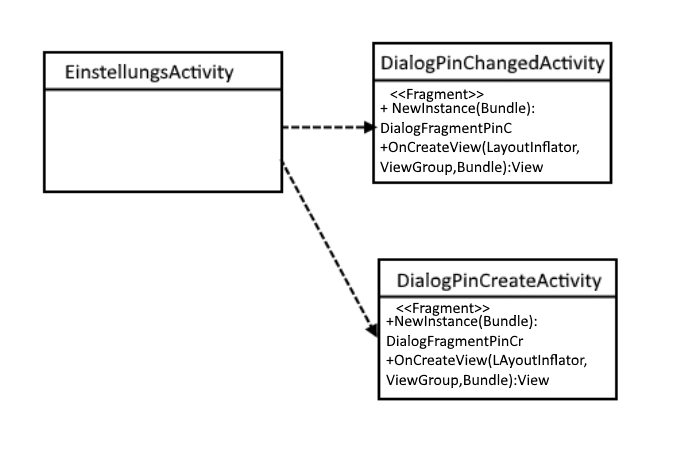

  
Stupro SS 2016 - WS 2017

<H1>
 SMART THINGS 
_Entwurf_</h1>
  
  
__Version__: 1.8

__Erstellt am:__ 27.05.2016

__Zuletzt geändert am:__ 25.07.2016

          
Inhalt

1. Kapitel 1.
	Einleitung
	Das Produkt Smart Things
	Begriffe
	Lizenz
	Entwurfsprinzipien

2. Kapitel 2.
	Architektur
	Komponentenübergreifende Funktion

3. Kapitel 3.
	Komponenten

4. Kapitel 4.
	Externe Schnittstellen

5. Kapitel 5.
	Universelle Schnittstelle

    
###<b>
Lizenz</b>

Dieses Dokument steht unter der <a href="http://creativecommons.org/licenses/by-nc/3.0/legalcode" title ="Titel"> Creative Common Public License 3.0</a> mit den Einschränkungen:
<i>Namensnennung</i> und <i>nicht-kommerziell.</i> 
Das bedeutet, dass Sie dieses Werk vervielfältigen, verbreiten und öffentlich zugänglich machen und verändern dürfen. Dabei muss jedoch beachtet werden, dass  Sie den Namen der Entwickler nennen müssen und  das Werk nicht für kommerzielle Zwecke genutzt werden darf.

##
Kapitel 1

###<b>Einleitung</b>

Ziel dieses Kapitel ist es den Leser einen Überblick über das entworfene Produkt und Entwurfsdokument zu verschaffen. Fragen über den Zweck des Produkts,  die gestellten Anforderungen sowie die betrachteten Prinzipien (Vorgehende Techniken) werden in diesen folgenden Abschnitten beantwortet.

###Das Produkt Smart Things

Zweck des unter dem Studienprojekt entstehende Produkt Smart Things ist es „smarte“ Hardware zu bauen. Unter Smart wird hier ein Produkt verstanden, welches sich mit den bereits entwickelten Middlewares RIOT und Kaa verbindet und durch Befehle der Software verschiedene Tätigkeiten ausübt ohne die Aufgaben direkt vom Nutzer zu bekommen.
Es werden 3 Smart Things Entwickelt, diese sind eine Kaschiermaschine, eine Smarte Lichtanlage und ein intelligentes Auto.
Die jeweiligen Anforderungen sind:
Kaffeemaschine: Die Kaffeemaschine sollte mit dem Smartphone bedienbar sein, so dass für jeden Benutzer der individuelle Kaffee gespeichert und gebrüht wird. Die Kaffeemaschine, die hierbei verwendet wird ist die Smarter Coffee Maschine, welche auf unseren Vorstellungen umgebaut wird.

Auto: Mithilfe von LEGO Minestorm wird das gewünschte Auto simuliert. Es soll mit dem Haus kommunizieren können. Wichtige Eigenschaft soll die Kommunikation mit den Lichtern des Hauses sein.

Licht: Um die Hausbeleuchtung zu simulieren wird ein Puppenhaus aus Holz gebaut welches mit LED Lichtern betrieben wird. Durch das Tablet sollen alle Lichter individuell ansteuerbar und eventuell auch dimmbar sein. Des Weiteren soll das Haus noch mit Tastern betrieben werden.
    
##Kapitel 2
###Architektur

In diesem Projekt gibt es drei Hauptkomponenten: die Steuerung per Server, die universelle Schnittstelle und die Geräte. 
Kaa und Riot sollen als Software für den Server verwendet werden. Je nachdem welche Software verwendet wird, muss die Datei in XML oder JSON-Code übersetzt werden. An diesem Server wird eine neutrale Schnittstelle angebaut. Hierbei sollen die Geräteinformationen in XML-Format oder per JSON-Code übergeben werden und für das entsprechende Gerät übersetzt werden. Dann werden die Befehle an die jeweilige Hardware gesendet.
 Für die Kaffeemaschine braucht man eine eigene Adapter Schnittstelle, die an die universelle Schnittstelle integriert ist, somit muss die Anwendung nicht auf ein extra Rasperry Pi geladen werden. Die Lichtsteuerungsanwendung ist auf dem Rasperry Pi vorhanden. 
In jeder Schnittstelle muss angegeben werden, ob es mit Kaa oder Riot kommunizieren möchte. 

###Hardware Kommunikation

Der Server leitet die Befehle von den Bedienungselementen weiter an den Banana Pi. Um die Verteilung der Befehle weiterzugeben wird ein Banana Pi benötigt, der per WLAN die Geräte ansteuert. Der Sensor von jedem Endprodukt empfängt die Befehle und ändert den Zustand des Geräts. Dies ermöglicht auch abzufragen, welches Gerät sich in welchem Zustand befindet. Zwischen der Zentralen Hardware und den Geräten werden die Informationen ausgetauscht, das heißt es liegt eine bidirektionale Beziehung vor zwischen Empfänger und dem Master

###Kommunikation durch Signale

Die Signale werden von dem Master auf die einzelnen Sensoren verteilt. Die Signale kommen dann entweder von anderen Geräten oder von den Bedienungselementen.

Kaffeemaschine 
Signale:
*Kaffee kochen
*Kochvorgang unterbrechen
*Brühstärke einstellen
*Tassenanzahl einstellen
*Warmhaltezeit der Warmhalteplatte einstellen

Empfangen von Statusmeldungen der Kaffeemaschine:  Status: Bereit, Wasser brühen, Bohnen malen,  Karaffe nicht vorhanden 
* Anzahl der eingestellten Tassen 
* Eingestellte Brühstärke
* Wasserstand
* Stärke des WiFi-S
Fehandlung der Befehle durch Exceptions: 
* Ungültige Parameter 
* Unbekannter Rückgabecode 
* Keine Antwort der Kaffeemaschine
* Kaffee wird bereits gekocht
* Niedriger Wasserstand 
* Kein Wasser
* Keine Karaffe  

Mindstorm Signale:
* Geschwindigkeit
* Distanz
* An/ Ausschalten

##Kapitel 3
###Komponenten Hauspanel

Der Benutzer bedient das Lenovo Tab oder das Smartphone durch eine App. Die App sendet Befehle an den Banana Pi. Die Steuerung ist auf dem Tab übersichtlicher. Es verwendet zudem auch WLAN zur Signalübertragung. Man sollte beachten, dass dieser Tablet Android 4.4 verwendet und nicht auf der aktuellsten Version ist.

####Server

Der Banana Pi dient als Server und leitet Befehle an das entsprechende Gerät weiter. Des Weiteren verfügt es ebenfalls über WLAN Schnittstelle und über 40 Eingänge, an denen man die weiteren Endgeräte anschließen kann.

####Rasperry Pi 3

Diese Komponente braucht die Befehle oder sogenannte Gerätecodes vom Banana Pi, um die Lichter an- und auszuschalten. Auf dem Rasperry Pi ist der Code vorhanden, um die Leds anzusteuern und die Schnittstelle zu implementieren. Der große Speicherplatz bietet den Vorteil die SDK von Kaa draufzuladen.

####Lichtansteuerung

Die folgenden Geräte werden für die Lichtsteuerung benötigt:
* Taster
* LEDs
* Wiederstände
* Steckplatinen
* Steckbrücken.

Die Leds lassen sich ebenfalls per Taster ansteuern. 

####Kaffeemaschine

Smarter SMC10EU Coffee verfügt über eine intrigierte App und eine eingebaute WLAN Kommunikation. Der Mahlgrad der Bohnen ist einstellbar. Zusätzlich zeigt der Wasserstandanzeiger mit, wie viel Tassen gebrüht werden können. Außerdem kann die Kaffeezubereitung voreingestellt werden. Es werden verschiedene Modi angeboten:
* Aufweck-Modus: verursacht einen Alarm-Ton, um sofort ein Kaffee bereit zu stellen.
* Welcome-Home-Modus: Smarter Coffee startet, sobald man durch die Tür tritt.  

####Entwurfsentscheidungen

Da unser Team sich entschieden hat Kaa und Riot zu verwenden, brauchen wir eine Schnittstelle, die mit beiden Middlewares zurechtkommt, woraufhin wir uns auf die universelle Schnittstelle geeinigt haben. Zudem bietet es sich an, die Schnittstelle auf jedem Gerät direkt zu implementieren. 

##Kapitel 4

###Schnittstellen
Schaubilt der Schnittstellen des Projektes:

Die Kommunikation verläuft zwischen Rasberry Pi und den KAA/ Riot Server durch Rest APi

####Externe Universelle
Grundlegende Architektur

Per Identifier wird der eingehende Datei-Typ erkannt. Nach dem erkennen, wird das entsprechende File an den jeweiligen Translator weitergeleitet.

Klassendiagramm Variante 1

Der Identifier und der Translator bilden unabhängige Klassen, die dadurch leichter ergänzt werden können. Außerdem kann dadurch für jeden Datentyp eine eigene Subklasse gebildet werden, die Besonderheiten von Sprachen einfacher beachten kann.

Klassendiagramm Variante 2

Sowohl der Interpreter als auch der Translator ist in der Controller-Klasse zusammengefasst. Nachteil dabei ist, dass die Erweiterung nicht so einfach möglich ist und man eventuell mehr Aufwand hat Besonderheiten der Typen zu berücksichtigen.

#### Struktogramme für die App

Mithilfe Dialoge kann man die Pin bearbeiten oder erstellen.

##Kapitel 5

####App

Vorraussetzung ist, das zu Kaa-Project eine Verbindung existiert, damit man auf die Hauptoberfläche gelangt.

Die App besteht aus Hauptoberfläche, die aus den Hardwareelementen besteht, sowie auch deren letzten Notifications, Kaa/Riot Verbindungen, Hilfe, Einstellungen und Exit.
Die Lizenz und das Impressum sind auf jeder Oberfläche vorhanden.

* Die Kaffeemaschine Oberfläche kann man die wöchentlich oder zweiwöchig regelmäßig Kaffee brühen an ausgewählten Tagen und Uhrzeiten. Diese tut man unter den Button "Speichern" in eine Datei speichern.

* Das Licht kann in einzelenen Räumen an- und ausgeschaltet werden.

* Man gelangt durch die Einstellungen auf die Kaa-Adminstrationsseite.
* Die Anwesenheitssimulation wählt man einen Zeitraum, in dem man im Urlaub ist. Zudem kann eine automatische Simulation benutzt werden oder eine eigene Simulation erstellt werden.
* Die Verbindung zu Kaa oder Riot können eingestellt werden.
* Unter Hilfe kann man Dokumentationen finden, die beim Bedienen der App helfen.

 

    
##Versionshistorie
Version 1.10 (19.09.2016)

		Überarbeitung Kapitel 4,Kaitel 5 - AB
Version 1.9 (23.8.2016)

		Überarbeitung Kapitel 4,Kaitel 5 - AB
Version 1.8 (25.7.2016)

		Überarbeitung Kapitel 4, Schnittstellen- L

Version 1.7 (21.7.2016)

		Überarbeitung Kapitel 5, Abschnitt Kommunikation -AB

Version 1.7 (21.7.2016)

		Überarbeitung Kapitel 5, Abschnitt Kommunikation -AB

Version 1.6 (7.7.2016)

		Überarbeitung -A
Version 1.5 (5.7.2016)

		Konvertierung in Markdown- LK
Version 1.4(20.06.2016)

		Komponenten Kapitel hinzugefügt- AB
Version 1.3 (20.06.2016)

		Grober Entwurf universelle Schnittstelle – MK
Version 1.2 (09.06.2016)

		Grobe Architektur
Version 1.1 (02.06.2016)

		Ausarbeitung des Entwurfs

Version 1.0 (27.05.2016)

	Erstellen, erster Entwurf des Inhalts
